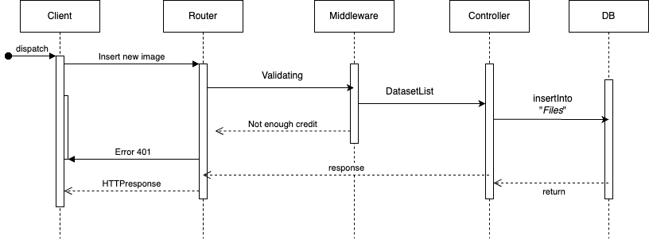

# Progetto programmazione avanzata

## Obiettivo
Si intende sviluppare un backend Node.js per processare e gestire i dataset di un modello di una rete neurale.
Gli utenti hanno la possibilità di caricare immagini o un insieme di frame (.zip) in uno specifico dataset, creabili a piacimento.
\
Una delle principali funzionalità sarà quella di effettuare task di segmentazione sui dataset, utilizzando il modello preaddestrato [*Segment Anything Model*](https://github.com/facebookresearch/segment-anything).

Data la richiesta computazionale elevata in fase di inferenza, il tutto verrà gestito tramite delle code di processi, con il tool [BullMQ](https://docs.bullmq.io/)

## Progettazione

### UML


### Sequence diagram
Si riportano i diagrammi di attivazione dei componenti coinvolti durante l'esecuzione delle richieste.
* Verificare il credito di un utente

* Ricaricare il credito di un utente

* Mostrare i dateset di un utente o tutti i dataset in caso di utente admin

* Rinominare/cancellazione di un dataset

* Caricamento di un'immagine in un dataset

* Caricare un file .zip che verrà poi estratto in un insieme di immagini

* Nuovo task di segmentazione

* Verifica dello stato/completamento di un task


## Utilizzo
In questa sezione vengono descritte tutte le possibili rotte che esplicano le funzionalità messe a disposizione dall'applicazione e i parametri della richiesta necessari.
| Verbo | Rotta |Descrizione|
| --- | --- | --- |
| GET | /budget | Leggere il credito di un utente |
| PATCH | /budget | Ricaricare il credito di un utente (funzionalità *admin*) |
| GET | /dataset |Lista dei dataset dell'utente che li richiede. (Se *admin* mostra tutti i ds. memorizzati)|
| POST | /dataset | Creazione di un nuovo dataset |
| PATCH | /dataset | Aggiornamento del nome di un dataset |
| DEL | /dataset| Eliminazione di un dataset |
| POST | /upload | Caricamento di una lista di immagini o file zip con insieme di frame |
| GET | /process | Richiesta di un nuovo task di segmentazione |
| GET | /status | Controllo dello stato attuale di un task avviato. In caso di completamento viene restituito il risultato della segmentazione (json) |

### Payloads

Per effettuare una richiesta al servizio bisogna inviare alla rotta prescelta, un ***Bearer Token*** che contenga al suo interno:
- la *signature* di autenticazione
- un *payload* con i parametri della richiesta, da inviare all'Api

>###### Postman Collections:<a name="postman"></a>
>https://elements.getpostman.com/redirect?entityId=28770373-ce316422-d0e3-4a6f-97da-53c6a2cf5429&entityType=collection


Riportiamo i payload di tutte le rotte utilizzabili.

```Json
POST /upload  (immagini)
{
  "email": "user@user.com",
  "role": "1",
  "dataset": "flowers",
  "files": [
    "/usr/src/images/f1.jpg",
    "/usr/src/images/f2.jpg",
    "/usr/src/images/f3.jpg"
  ]
}
```
```Json
POST /upload  (file .zip)
{
  "email": "user@user.com",
  "role": "1",
  "dataset": "dogs",
  "files": [
    "/usr/src/images/pack.zip"
  ]
}
```
```Json
POST /upload  (test unsupported file)
{
  "email": "user@user.com",
  "role": "1",
  "budget": 99,
  "receiver": "user2@user.com",
  "dataset": "flowers",
  "newName": "flowers1",
  "files": [
    "/Users/dataset/f1.jpg",
    "/Users/dataset/f1.zip",
    "/Users/dataset/f1.ppt"
  ]
}
```
```Json
GET /dataset  |  GET /budget
{
  "email": "user@user.com",
  "role": "1"
}
```
```Json
GET /dataset  (amministratore)
{
  "email": "admin@admin.com",
  "role": "0"
}
```
```Json
PATCH /budget  (amministratore)
{
  "email": "admin@admin.com",
  "role": "0",
  "receiver": "user@user.com",
  "budget": 200
}
```
```Json
POST /dataset
{
  "email": "user@user.com",
  "role": "1",
  "dataset": "flowers"
}
```
```Json
PATCH /dataset   |  DELETE /dataset
{
  "email": "user@user.com",
  "role": "1",
  "dataset": "flowers",
  "newName": "flowers1"
}
```
```Json
{
  "email": "user@user.com",
  "role": "1",
  "dataset": "flowers"
}
```

```Json
GET /process
{
  "email": "user@user.com",
  "role": "1",
  "dataset": "flowers"
}
```
```Json
GET /process
{
  "email": "user@user.com",
  "role": "1",
  "dataset": "flowers",
  "pid": "pid_a1f"
}
```

- E' possibile generare un token personalizzato mediante il servizio https://jwt.io/
- Si è convenuto usare il valore '0' per indicare un'account amministratore e '1' per lo user. 
#### Utenti predefiniti
|Email|Ruolo|Payload|
|---|---|--|
|user@user.com| *user* | 1|
|user2@user.com| *user*|1|
|admin@admin.com|*admin*|0|

## Pattern usati

### Singleton

Il pattern Singleton garantisce che per una classe venga creata una ed una sola istanza. 
L'applicazione lo implementa nella classe [Database.ts](https://github.com/MarcoP1999/programmazione_avanzata/blob/main/model/Database.ts) in modo da permettere un'unica istanza di connessione al Database evitando richieste multiple.

### MVC

L'intera applicazione si basa sul pattern Model View Controller:  
* Il Model contiene l'interfaccia di accesso ai dati, ma non la logica di gestione o visualizzazione.
* La View corrisponde all'interfaccia grafica (GUI), ma dato che le specifiche non ne richiedevano l'implementazione, si invieranno i comandi tramite Postman.
* Il Controller gestisce i dati del Model, li manipola e realizza le funzioni implementate.  
Al termine li invia all'interfaccia che può variare, lasciando inalterata logica di business dell'applicazione.
  

### Chain of responsibility (Middleware)

Per *middleware* si intende uno strato software precedente il controller, che mette a disposizione funzionalità intermedie.
In questo caso si occupa di:
- validare l'identità delle richieste e la [(Authorization)](https://github.com/MarcoP1999/programmazione_avanzata/blob/main/middleware/authorization.ts);
- controllare la validità dei [file](https://github.com/MarcoP1999/programmazione_avanzata/blob/main/middleware/fileUploader.ts) prima dell'upload e processamento;
- intermediatore tra il framework e il [processo Python](https://github.com/MarcoP1999/programmazione_avanzata/blob/main/middleware/pythonAdapter.ts) che implementa il modello SAM;

Più metodi middleware vengono collegati 'in cascata' su determinate rotte, prima di attivare il controller predisposto.

## Workflow di utilizzo
Per utilizzare il progetto, è necessario seguire questi passaggi:

1. Recuperare il progetto tramite l'URL del repository Git (wget) o scaricando manualmente il file ZIP.
2. Importare il pacchetto di chiamate [Postman](#postman).
3. Compilare il file **.env** con i dati consigliati:

```Javascript
PGUSER = postgres  
PGPASSWORD = postgres  
PGDATABASE = SAM_storage
PGHOST = postgres_db //come il Docker service
PGPORT = 5432
REDIS_HOST = cache
REDIS_PORT = 6379
APPPORT = 8080
APPHOST = 0.0.0.0
SECRET_KEY = sam
//share host folder (with img to upload) to container
LOCAL_DATASET = /Users/dataset/  
```
4. Installare Docker dal sito ufficiale ed avviare l'engine.
5. Aprire il terminale posizionandosi nella cartella di progetto; poi digitare
```
docker compose up
```
6. Inviare le chiamate al server per ottenere le risposte dall'api.

## Software utilizzati
* [Express.js](https://expressjs.com/it/)
* [Postgres](https://www.postgresql.org/)
* [Node.js](https://nodejs.org/en)
* [JsonWebToken](https://jwt.io/)
* [VisualStudio Code](https://code.visualstudio.com/)
* [Typescript](https://www.typescriptlang.org/)
* [Docker](https://www.docker.com/)
* [Sequelize](https://sequelize.org/)
* [BullMQ](https://docs.bullmq.io/)
* [Postman](https://www.postman.com/)
* [Segment Anything Model](https://github.com/facebookresearch/segment-anything)

## Autori
* [Alesi Mattia &nbsp; s1114418](https://github.com/alesimattia)
* [Proietti Marco &nbsp; s1114163](https://github.com/MarcoP1999)
